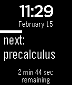
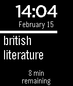

&nbsp;&nbsp;&nbsp;

# next
next is a watchface for the [Pebble Smartwatch](https://getpebble.com) that, when provided with your class schedule, shows your current class, the amount of time until the next period, and what class is next.

**Warning**: next is in an alpha stage, at best. It is probably battery inefficient and should not be run outside of school hours for long periods of time. 

## Setup
### Configuration
Copy src/config.sample.c to src/config.c.

start\_time and end\_times are specified in 24-hour time, with leading zeros (e.g. 08:00).

Fill in your school's start and end time and copy the course blocks (beginning with a comma and ending with a } bracket) as many times as necessary, filling in their name, start\_time, and end\_time.

### Installation
Compile and install using the [Pebble SDK](https://developer.getpebble.com/2/getting-started/).

    pebble build
    pebble install --phone [PHONEIP]

## License
    Copyright (c) 2014 Henri Watson
    
    Permission is hereby granted, free of charge, to any person obtaining a copy
    of this software and associated documentation files (the "Software"), to deal
    in the Software without restriction, including without limitation the rights
    to use, copy, modify, merge, publish, distribute, sublicense, and/or sell
    copies of the Software, and to permit persons to whom the Software is
    furnished to do so, subject to the following conditions:
    
    The above copyright notice and this permission notice shall be included in
    all copies or substantial portions of the Software.
    
    THE SOFTWARE IS PROVIDED "AS IS", WITHOUT WARRANTY OF ANY KIND, EXPRESS OR
    IMPLIED, INCLUDING BUT NOT LIMITED TO THE WARRANTIES OF MERCHANTABILITY,
    FITNESS FOR A PARTICULAR PURPOSE AND NONINFRINGEMENT. IN NO EVENT SHALL THE
    AUTHORS OR COPYRIGHT HOLDERS BE LIABLE FOR ANY CLAIM, DAMAGES OR OTHER
    LIABILITY, WHETHER IN AN ACTION OF CONTRACT, TORT OR OTHERWISE, ARISING FROM,
    OUT OF OR IN CONNECTION WITH THE SOFTWARE OR THE USE OR OTHER DEALINGS IN
    THE SOFTWARE.